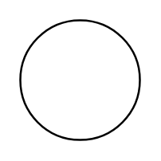

# On-Page Reference

## Definition

```
{
  _style: 'verticalLabelPosition=bottom;verticalAlign=top;html=1;shape=mxgraph.flowchart.on-page_reference;',
  _width: 60,
  _height: 60,
}
```

## Usage

```
import { OnPageReference } from '@diac/standard-components-diagrams/flowchart'

<OnPageReference/>
```

## Preview


