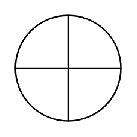

# Or

## Definition

```
{
  _style: { 
    entity: 'verticalLabelPosition=bottom;verticalAlign=top;html=1;shape=mxgraph.flowchart.summing_function;',
  },
  _original_width: 70,
  _original_height: 70,
}
```

## Usage

```
import { Or } from '@diac/standard-components-diagrams/flowchart'

<Or/>
```

## Preview


