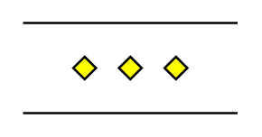

# Parallel Mode

## Definition

```
{
  _style: { 
    entity: 'verticalLabelPosition=bottom;verticalAlign=top;html=1;shape=mxgraph.flowchart.parallel_mode;pointerEvents=1',
  },
  _original_width: 95,
  _original_height: 40,
}
```

## Usage

```
import { ParallelMode } from '@dinghy/standard-components-diagrams/flowchart'

<ParallelMode/>
```

## Preview


