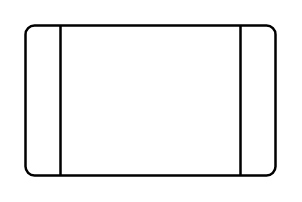

# Predefined Process

## Definition

```
{
  _style: 'verticalLabelPosition=bottom;verticalAlign=top;html=1;shape=process;whiteSpace=wrap;rounded=1;size=0.14;arcSize=6;',
  _width: 100,
  _height: 60,
}
```

## Usage

```
import { PredefinedProcess } from '@reactiac/standard-components-diagrams/flowchart'

<PredefinedProcess/>
```

## Preview


