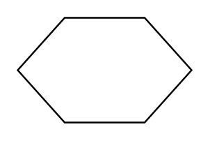

# Preparation

## Definition

```
{
  _style: { 
    entity: 'verticalLabelPosition=bottom;verticalAlign=top;html=1;shape=hexagon;perimeter=hexagonPerimeter2;arcSize=6;size=0.27;',
  },
  _original_width: 100,
  _original_height: 60,
}
```

## Usage

```
import { Preparation } from '@diac/standard-components-diagrams/flowchart'

<Preparation/>
```

## Preview


