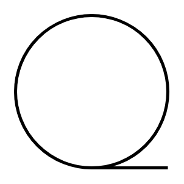

# Sequential Data

## Definition

```
{
  _style: 'strokeWidth=2;html=1;shape=mxgraph.flowchart.sequential_data;whiteSpace=wrap;',
  _width: 60,
  _height: 60,
}
```

## Usage

```
import { SequentialData } from '@diac/standard-components-diagrams/flowchart'

<SequentialData/>
```

## Preview


