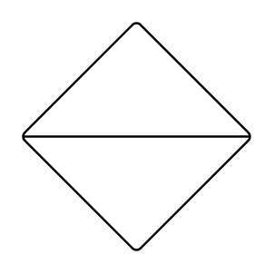

# Sort

## Definition

```
{
  _style: 'verticalLabelPosition=bottom;verticalAlign=top;html=1;shape=mxgraph.flowchart.sort;',
  _width: 100,
  _height: 100,
}
```

## Usage

```
import { Sort } from '@reactiac/standard-components-diagrams/flowchart'

<Sort/>
```

## Preview


