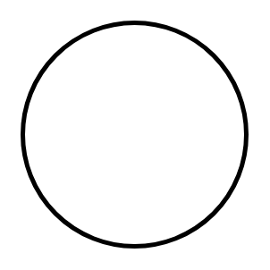

# Start 2

## Definition

```
{
  _style: { 
    entity: 'strokeWidth=2;html=1;shape=mxgraph.flowchart.start_2;whiteSpace=wrap;',
  },
  _original_width: 100,
  _original_height: 100,
}
```

## Usage

```
import { Start2 } from '@diac/standard-components-diagrams/flowchart'

<Start2/>
```

## Preview


