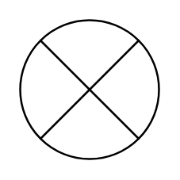

# Summing Junction

## Definition

```
{
  _style: { 
    entity: 'verticalLabelPosition=bottom;verticalAlign=top;html=1;shape=mxgraph.flowchart.or;',
  },
  _width: 60,
  _height: 60,
}
```

## Usage

```
import { SummingJunction } from '@diac/standard-components-diagrams/flowchart'

<SummingJunction/>
```

## Preview


