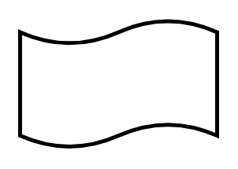

# Tape

## Definition

```
{
  _style: 'shape=tape;whiteSpace=wrap;html=1;strokeWidth=2;size=0.19',
  _width: 100,
  _height: 65,
}
```

## Usage

```
import { Tape } from '@reactiac/standard-components-diagrams/flowchart'

<Tape/>
```

## Preview


