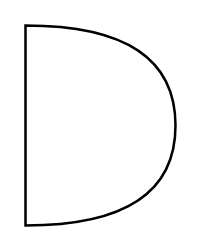

# And

## Definition

```
{
  _style: { 
    entity: 'shape=or;whiteSpace=wrap;html=1;',
  },
  _width: 60,
  _height: 80,
}
```

## Usage

```
import { And } from '@diac/standard-components-diagrams/general'

<And/>
```

## Preview


