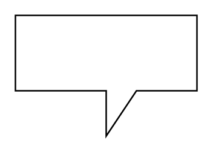

# Callout

## Definition

```
{
  _style: 'shape=callout;whiteSpace=wrap;html=1;perimeter=calloutPerimeter;',
  _width: 120,
  _height: 80,
}
```

## Usage

```
import { Callout } from '@reactiac/standard-components-diagrams/general'

<Callout/>
```

## Preview


