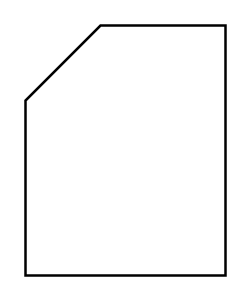

# Card

## Definition

```
{
  _style: { 
    entity: 'shape=card;whiteSpace=wrap;html=1;',
  },
  _original_width: 80,
  _original_height: 100,
}
```

## Usage

```
import { Card } from '@dinghy/standard-components-diagrams/general'

<Card/>
```

## Preview


