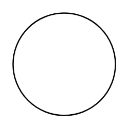

# Circle

## Definition

```
{
  _style: 'ellipse;whiteSpace=wrap;html=1;aspect=fixed;',
  _width: 60,
  _height: 60,
}
```

## Usage

```
import { Circle } from '@diac/standard-components-diagrams/general'

<Circle/>
```

## Preview


