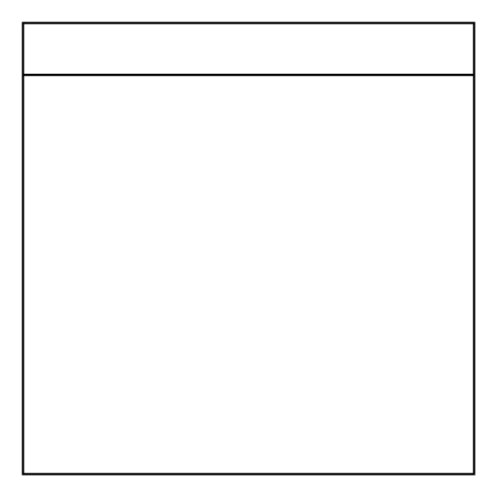

# Container 2

## Definition

```
{
  _style: { 
    entity: 'swimlane;whiteSpace=wrap;html=1;',
  },
  _original_width: 200,
  _original_height: 200,
}
```

## Usage

```
import { Container2 } from '@dinghy/standard-components-diagrams/general'

<Container2/>
```

## Preview


