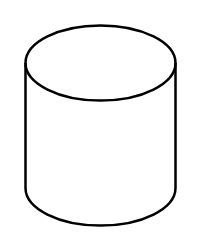

# Cylinder

## Definition

```
{
  _style: { 
    entity: 'shape=cylinder3;whiteSpace=wrap;html=1;boundedLbl=1;backgroundOutline=1;size=15;',
  },
  _original_width: 60,
  _original_height: 80,
}
```

## Usage

```
import { Cylinder } from '@dinghy/standard-components-diagrams/general'

<Cylinder/>
```

## Preview


