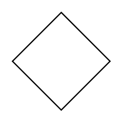

# Diamond

## Definition

```
{
  _style: 'rhombus;whiteSpace=wrap;html=1;',
  _width: 80,
  _height: 80,
}
```

## Usage

```
import { Diamond } from '@reactiac/standard-components-diagrams/general'

<Diamond/>
```

## Preview


