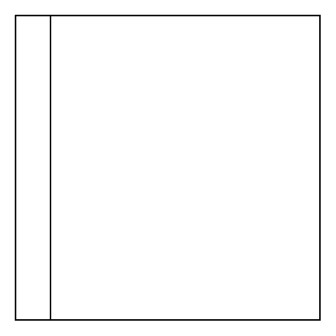

# Horizontal Container

## Definition

```
{
  _style: { 
    entity: 'swimlane;horizontal=0;whiteSpace=wrap;html=1;',
  },
  _width: 200,
  _height: 200,
}
```

## Usage

```
import { HorizontalContainer } from '@diac/standard-components-diagrams/general'

<HorizontalContainer/>
```

## Preview


