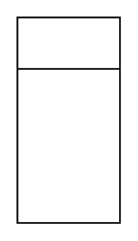

# List

## Definition

```
{
  _style: { 
    entity: 'swimlane;fontStyle=0;childLayout=stackLayout;horizontal=1;startSize=30;horizontalStack=0;resizeParent=1;resizeParentMax=0;resizeLast=0;collapsible=1;marginBottom=0;whiteSpace=wrap;html=1;',
  },
  _original_width: 0,
  _original_height: 120,
}
```

## Usage

```
import { List } from '@dinghy/standard-components-diagrams/general'

<List/>
```

## Preview


