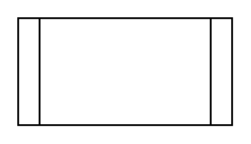

# Process

## Definition

```
{
  _style: { 
    entity: 'shape=process;whiteSpace=wrap;html=1;backgroundOutline=1;',
  },
  _original_width: 120,
  _original_height: 60,
}
```

## Usage

```
import { Process } from '@diac/standard-components-diagrams/general'

<Process/>
```

## Preview


