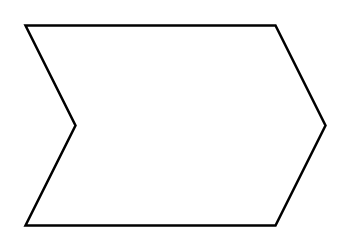

# Step

## Definition

```
{
  _style: { 
    entity: 'shape=step;perimeter=stepPerimeter;whiteSpace=wrap;html=1;fixedSize=1;',
  },
  _width: 120,
  _height: 80,
}
```

## Usage

```
import { Step } from '@diac/standard-components-diagrams/general'

<Step/>
```

## Preview


