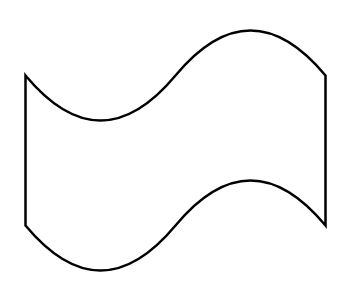

# Tape

## Definition

```
{
  _style: 'shape=tape;whiteSpace=wrap;html=1;',
  _width: 120,
  _height: 100,
}
```

## Usage

```
import { Tape } from '@diac/standard-components-diagrams/general'

<Tape/>
```

## Preview


