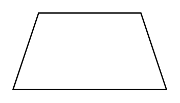

# Trapezoid

## Definition

```
{
  _style: { 
    entity: 'shape=trapezoid;perimeter=trapezoidPerimeter;whiteSpace=wrap;html=1;fixedSize=1;',
  },
  _original_width: 120,
  _original_height: 60,
}
```

## Usage

```
import { Trapezoid } from '@diac/standard-components-diagrams/general'

<Trapezoid/>
```

## Preview


