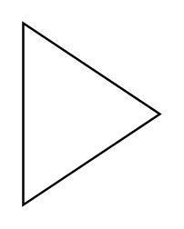

# Triangle

## Definition

```
{
  _style: { 
    entity: 'triangle;whiteSpace=wrap;html=1;',
  },
  _original_width: 60,
  _original_height: 80,
}
```

## Usage

```
import { Triangle } from '@dinghy/standard-components-diagrams/general'

<Triangle/>
```

## Preview


