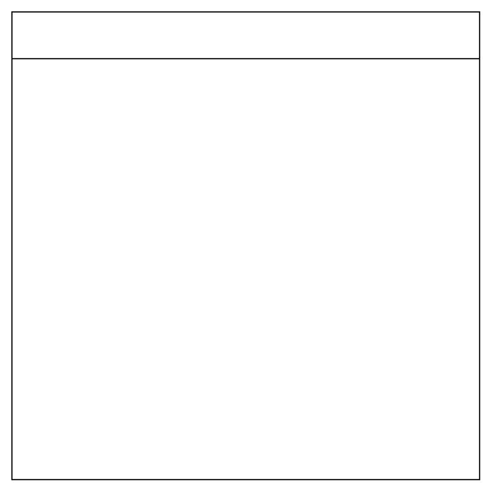

# Cross-Functional Flowchart

## Definition

```
{
  _style: { 
    entity: 'shape=table;childLayout=tableLayout;startSize=40;collapsible=0;recursiveResize=0;expand=0;fontSize=16;',
  },
  _original_width: 400,
  _original_height: 400,
}
```

## Usage

```
import { CrossFunctionalFlowchart } from '@dinghy/standard-components-diagrams/misc'

<CrossFunctionalFlowchart/>
```

## Preview


