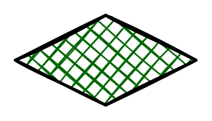

# Diamond Sketch

## Definition

```
{
  _style: 'rhombus;whiteSpace=wrap;html=1;strokeWidth=2;fillWeight=-1;hachureGap=8;fillStyle=cross-hatch;fillColor=#006600;sketch=1;',
  _width: 120,
  _height: 60,
}
```

## Usage

```
import { DiamondSketch } from '@diac/standard-components-diagrams/misc'

<DiamondSketch/>
```

## Preview


