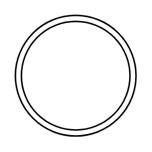

# Double Circle

## Definition

```
{
  _style: { 
    entity: 'ellipse;shape=doubleEllipse;whiteSpace=wrap;html=1;aspect=fixed;',
  },
  _original_width: 80,
  _original_height: 80,
}
```

## Usage

```
import { DoubleCircle } from '@dinghy/standard-components-diagrams/misc'

<DoubleCircle/>
```

## Preview


