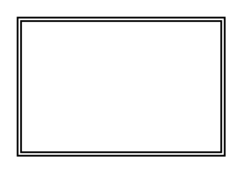

# Double Rectangle

## Definition

```
{
  _style: { 
    entity: 'shape=ext;double=1;rounded=0;whiteSpace=wrap;html=1;',
  },
  _original_width: 120,
  _original_height: 80,
}
```

## Usage

```
import { DoubleRectangle } from '@diac/standard-components-diagrams/misc'

<DoubleRectangle/>
```

## Preview


