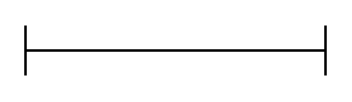

# Horizontal Crossbar

## Definition

```
{
  _style: { 
    entity: 'shape=crossbar;whiteSpace=wrap;html=1;rounded=1;',
  },
  _original_width: 120,
  _original_height: 20,
}
```

## Usage

```
import { HorizontalCrossbar } from '@diac/standard-components-diagrams/misc'

<HorizontalCrossbar/>
```

## Preview


