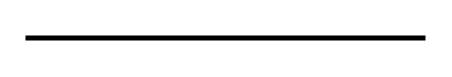

# Horizontal Line

## Definition

```
{
  _style: 'line;strokeWidth=2;html=1;',
  _width: 160,
  _height: 10,
}
```

## Usage

```
import { HorizontalLine } from '@reactiac/standard-components-diagrams/misc'

<HorizontalLine/>
```

## Preview


