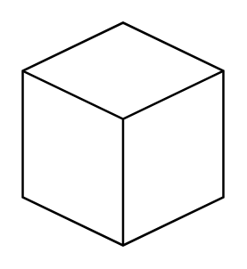

# Isometric Cube

## Definition

```
{
  _style: { 
    entity: 'html=1;whiteSpace=wrap;shape=isoCube2;backgroundOutline=1;isoAngle=15;',
  },
  _original_width: 90,
  _original_height: 100,
}
```

## Usage

```
import { IsometricCube } from '@dinghy/standard-components-diagrams/misc'

<IsometricCube/>
```

## Preview


