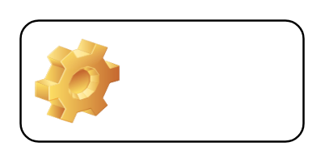

# Label 1

## Definition

```
{
  _style: 'label;whiteSpace=wrap;html=1;image=img/clipart/Gear_128x128.png',
  _width: 140,
  _height: 60,
}
```

## Usage

```
import { Label1 } from '@reactiac/standard-components-diagrams/misc'

<Label1/>
```

## Preview


