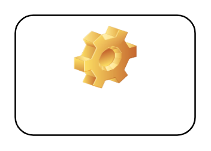

# Label 2

## Definition

```
{
  _style: 'label;whiteSpace=wrap;html=1;align=center;verticalAlign=bottom;spacingLeft=0;spacingBottom=4;imageAlign=center;imageVerticalAlign=top;image=img/clipart/Gear_128x128.png',
  _width: 120,
  _height: 80,
}
```

## Usage

```
import { Label2 } from '@reactiac/standard-components-diagrams/misc'

<Label2/>
```

## Preview


