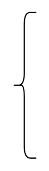

# Left Curly Bracket

## Definition

```
{
  _style: 'shape=curlyBracket;whiteSpace=wrap;html=1;rounded=1;labelPosition=left;verticalLabelPosition=middle;align=right;verticalAlign=middle;',
  _width: 20,
  _height: 120,
}
```

## Usage

```
import { LeftCurlyBracket } from '@diac/standard-components-diagrams/misc'

<LeftCurlyBracket/>
```

## Preview


