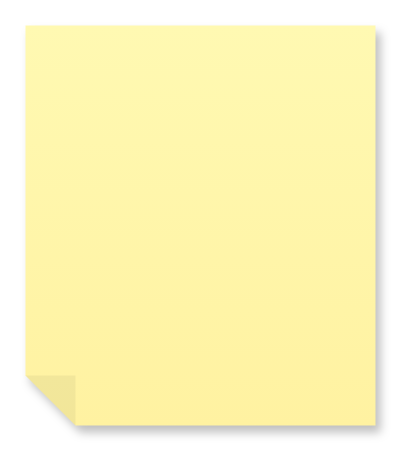

# Note

## Definition

```
{
  _style: { 
    entity: 'shape=note;whiteSpace=wrap;html=1;backgroundOutline=1;fontColor=#000000;darkOpacity=0.05;fillColor=#FFF9B2;strokeColor=none;fillStyle=solid;direction=west;gradientDirection=north;gradientColor=#FFF2A1;shadow=1;size=20;pointerEvents=1;',
  },
  _original_width: 140,
  _original_height: 160,
}
```

## Usage

```
import { Note } from '@dinghy/standard-components-diagrams/misc'

<Note/>
```

## Preview


