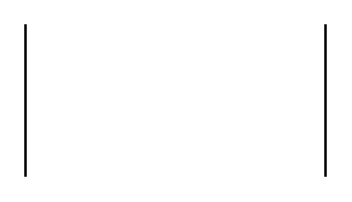

# Partial Rectangle 2

## Definition

```
{
  _style: 'shape=partialRectangle;whiteSpace=wrap;html=1;bottom=0;top=0;fillColor=none;',
  _width: 120,
  _height: 60,
}
```

## Usage

```
import { PartialRectangle2 } from '@diac/standard-components-diagrams/misc'

<PartialRectangle2/>
```

## Preview


