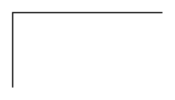

# Partial Rectangle 3

## Definition

```
{
  _style: 'shape=partialRectangle;whiteSpace=wrap;html=1;bottom=0;right=0;fillColor=none;',
  _width: 120,
  _height: 60,
}
```

## Usage

```
import { PartialRectangle3 } from '@diac/standard-components-diagrams/misc'

<PartialRectangle3/>
```

## Preview


