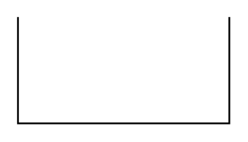

# Partial Rectangle 4

## Definition

```
{
  _style: 'shape=partialRectangle;whiteSpace=wrap;html=1;bottom=1;right=1;left=1;top=0;fillColor=none;routingCenterX=-0.5;',
  _width: 120,
  _height: 60,
}
```

## Usage

```
import { PartialRectangle4 } from '@reactiac/standard-components-diagrams/misc'

<PartialRectangle4/>
```

## Preview


