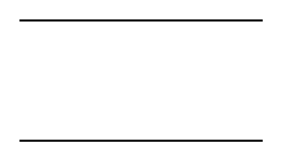

# Partial Rectangle

## Definition

```
{
  _style: { 
    entity: 'shape=partialRectangle;whiteSpace=wrap;html=1;left=0;right=0;fillColor=none;',
  },
  _original_width: 120,
  _original_height: 60,
}
```

## Usage

```
import { PartialRectangle } from '@diac/standard-components-diagrams/misc'

<PartialRectangle/>
```

## Preview


