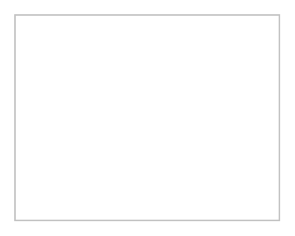

# Table 3

## Definition

```
{
  _style: 'childLayout=tableLayout;recursiveResize=0;shadow=0;fillColor=none;strokeColor=#C0C0C0;',
  _width: 180,
  _height: 140,
}
```

## Usage

```
import { Table3 } from '@reactiac/standard-components-diagrams/misc'

<Table3/>
```

## Preview


