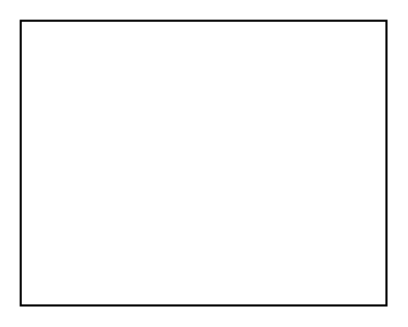

# Table 4

## Definition

```
{
  _style: { 
    entity: 'childLayout=tableLayout;recursiveResize=0;shadow=0;fillColor=none;',
  },
  _original_width: 180,
  _original_height: 140,
}
```

## Usage

```
import { Table4 } from '@dinghy/standard-components-diagrams/misc'

<Table4/>
```

## Preview


