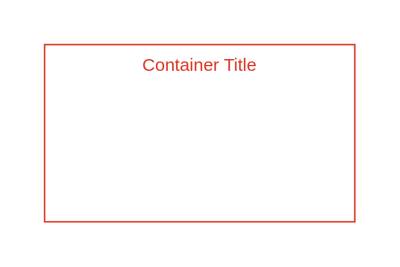

# Security group

## Definition

```js
{
  _style: {
    container: 'fillColor=none;strokeColor=#DD3522;verticalAlign=top;fontStyle=0;fontColor=#DD3522;whiteSpace=wrap;html=1;',
    entity:{
      strokeColor:'#DD3522',fontColor:'#DD3522',},
    },
}
```

## Usage

```js
import { SecurityGroup } from '@dinghy/standard-components-diagrams/awsGroups'

<SecurityGroup/>
```

## Preview


