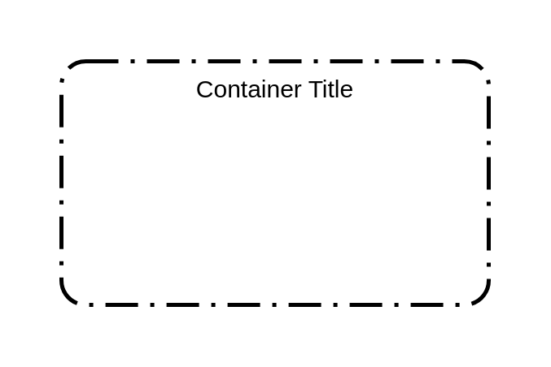

# Auto Scaling Group

## Definition

```js
{
  _style: {
    container: 'rounded=1;arcSize=10;dashed=1;fillColor=none;gradientColor=none;dashPattern=8 3 1 3;strokeWidth=2;',
    },
}
```

## Usage

```js
import { AutoScalingGroup } from '@dinghy/standard-components-diagrams/aws17Groups'

<AutoScalingGroup/>
```

## Preview


