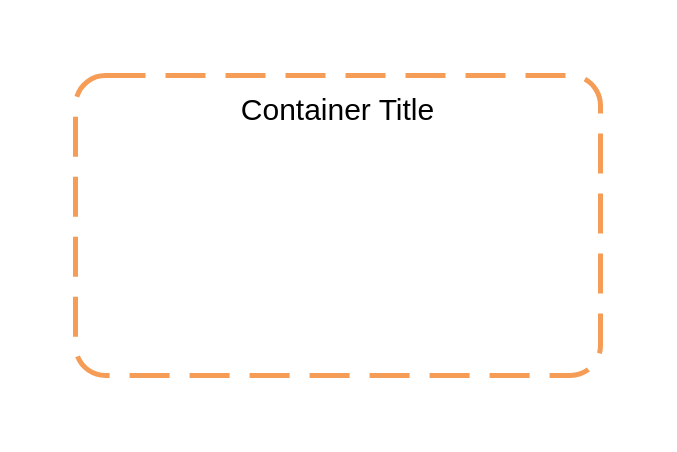

# Availability Zone

## Definition

```js
{
  _style: {
    container: 'rounded=1;arcSize=10;dashed=1;strokeColor=#F59D56;fillColor=none;gradientColor=none;dashPattern=8 4;strokeWidth=2;',
    entity:{
      strokeColor:'#F59D56',},
    },
}
```

## Usage

```js
import { AvailabilityZone } from '@dinghy/standard-components-diagrams/aws17Groups'

<AvailabilityZone/>
```

## Preview


