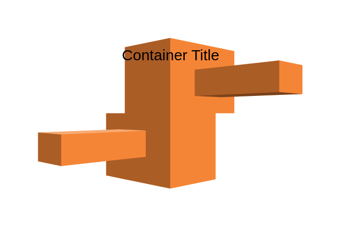

# Elastic Beanstalk Container 2

## Definition

```js
{
  _style: {
    container: 'dashed=0;html=1;shape=mxgraph.aws3.elastic_beanstalk;fillColor=#F58536;gradientColor=none;dashed=0;',
    entity:{
      fillColor:'#F58536',},
    },
}
```

## Usage

```js
import { ElasticBeanstalkContainer2 } from '@dinghy/standard-components-diagrams/aws17Groups'

<ElasticBeanstalkContainer2/>
```

## Preview


