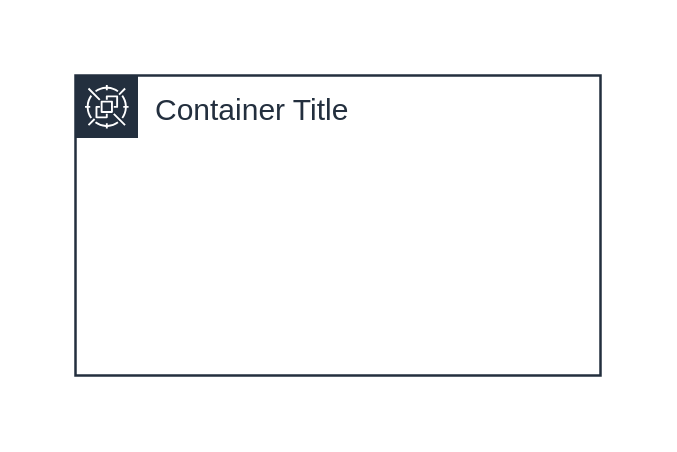

# Spot Fleet

## Definition

```js
{
  _style: {
    container: 'sketch=0;outlineConnect=0;gradientColor=none;html=1;whiteSpace=wrap;fontSize=12;fontStyle=0;shape=mxgraph.aws4.group;grIcon=mxgraph.aws4.group_spot_fleet;strokeColor=#232F3E;fillColor=none;verticalAlign=top;align=left;spacingLeft=30;fontColor=#232F3E;dashed=0;',
    entity:{
      strokeColor:'#232F3E',fontColor:'#232F3E',},
    },
}
```

## Usage

```js
import { SpotFleet } from '@dinghy/standard-components-diagrams/aws18GroupsLight'

<SpotFleet/>
```

## Preview


