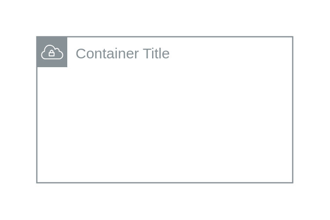

# VPC

## Definition

```js
{
  _style: {
    container: 'sketch=0;outlineConnect=0;gradientColor=none;html=1;whiteSpace=wrap;fontSize=12;fontStyle=0;shape=mxgraph.aws4.group;grIcon=mxgraph.aws4.group_vpc;strokeColor=#879196;fillColor=none;verticalAlign=top;align=left;spacingLeft=30;fontColor=#879196;dashed=0;',
    entity:{
      strokeColor:'#879196',fontColor:'#879196',},
    },
}
```

## Usage

```js
import { Vpc } from '@dinghy/standard-components-diagrams/aws18GroupsLight'

<Vpc/>
```

## Preview


