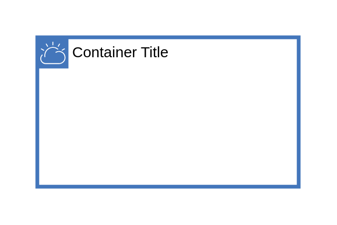

# IBM Cloud

## Definition

```js
{
  _style: {
    container: 'shape=mxgraph.ibm.box;prType=cloud;fontStyle=0;verticalAlign=top;align=left;spacingLeft=32;spacingTop=4;fillColor=none;rounded=0;whiteSpace=wrap;html=1;strokeColor=#4376BB;strokeWidth=3;dashed=0;container=1;spacing=-4;collapsible=0;expand=0;recursiveResize=0;',
    entity:{
      strokeColor:'#4376BB',},
    },
}
```

## Usage

```js
import { IbmCloud } from '@dinghy/standard-components-diagrams/ibmBoxes'

<IbmCloud/>
```

## Preview


