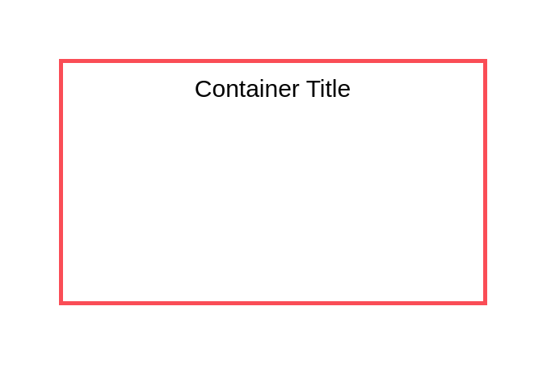

# Authorization Boundary

## Definition

```js
{
  _style: {
    container: 'container=1;collapsible=0;expand=0;recursiveResize=0;html=1;whiteSpace=wrap;strokeColor=#FA4D56;fillColor=none;strokeWidth=2',
    entity:{
      strokeColor:'#FA4D56',},
    },
}
```

## Usage

```js
import { AuthorizationBoundary } from '@dinghy/standard-components-diagrams/ibmCloudGroups'

<AuthorizationBoundary/>
```

## Preview


