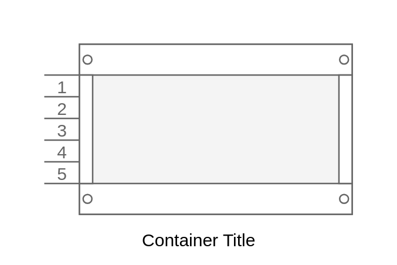

# Numbered Rack Cabinet

## Definition

```js
{
  _style: {
    container: 'strokeColor=#666666;html=1;verticalLabelPosition=bottom;labelBackgroundColor=#ffffff;verticalAlign=top;outlineConnect=0;shadow=0;dashed=0;shape=mxgraph.rackGeneral.rackCabinet3;fillColor2=#f4f4f4;container=1;collapsible=0;childLayout=rack;allowGaps=1;marginLeft=33;marginRight=9;marginTop=21;marginBottom=22;textColor=#666666;numDisp=ascend;',
    entity:{
      strokeColor:'#666666',},
    },
}
```

## Usage

```js
import { NumberedRackCabinet } from '@dinghy/standard-components-diagrams/rackGeneral'

<NumberedRackCabinet/>
```

## Preview


